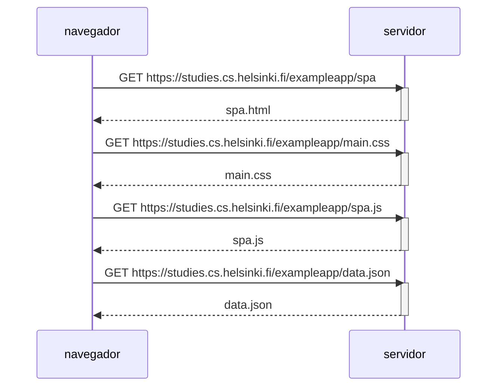

## sequenceDiagram

 

```mermaid

sequenceDiagram
    participant navegador
    participant servidor

    navegador ->> servidor: GET https://studies.cs.helsinki.fi/exampleapp/spa
    activate servidor
    servidor -->> navegador: spa.html
    deactivate servidor

    navegador ->> servidor: GET https://studies.cs.helsinki.fi/exampleapp/main.css
    activate servidor
    servidor -->> navegador: main.css
    deactivate servidor

    navegador ->> servidor: GET https://studies.cs.helsinki.fi/exampleapp/spa.js
    activate servidor
    servidor -->> navegador: spa.js
    deactivate servidor

    navegador ->> servidor: GET https://studies.cs.helsinki.fi/exampleapp/data.json
    activate servidor
    servidor -->> navegador: data.json
    deactivate servidor

    

```

