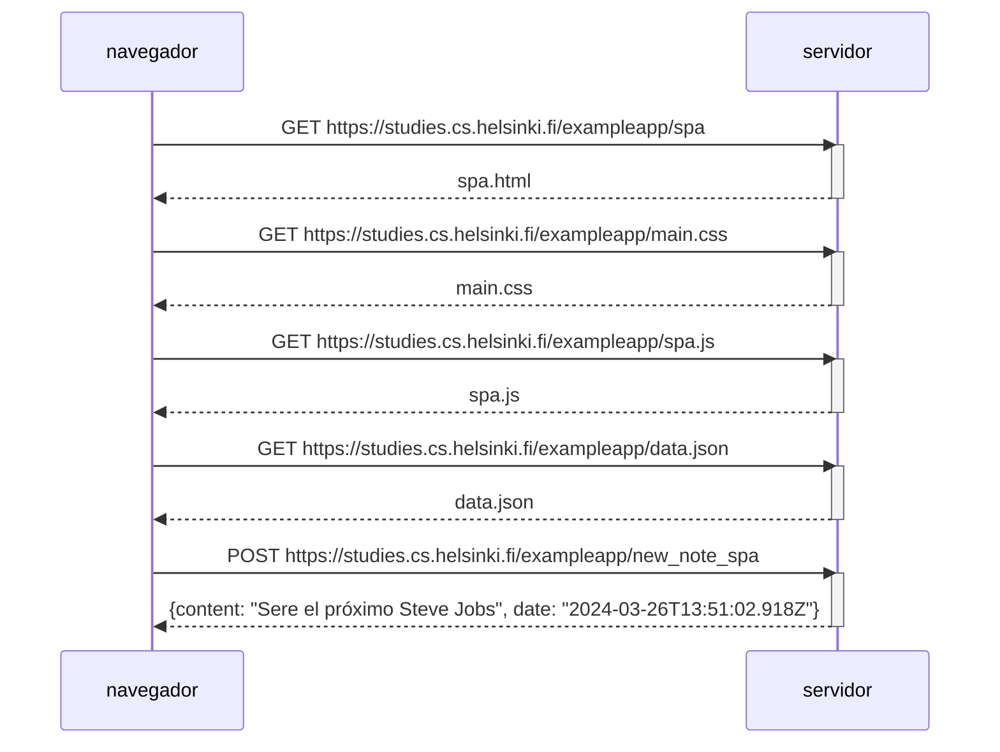

## sequenceDiagram

 

```mermaid
sequenceDiagram
    participant navegador
    participant servidor

    navegador ->> servidor: GET https://studies.cs.helsinki.fi/exampleapp/spa
    activate servidor
    servidor -->> navegador: spa.html
    deactivate servidor

    navegador ->> servidor: GET https://studies.cs.helsinki.fi/exampleapp/main.css
    activate servidor
    servidor -->> navegador: main.css
    deactivate servidor

    navegador ->> servidor: GET https://studies.cs.helsinki.fi/exampleapp/spa.js
    activate servidor
    servidor -->> navegador: spa.js
    deactivate servidor

    navegador ->> servidor: GET https://studies.cs.helsinki.fi/exampleapp/data.json
    activate servidor
    servidor -->> navegador: data.json
    deactivate servidor

    navegador ->> servidor: POST https://studies.cs.helsinki.fi/exampleapp/new_note_spa
    activate servidor
    servidor -->> navegador: {content: "Sere el próximo Steve Jobs", date: "2024-03-26T13:51:02.918Z"}
    deactivate servidor


```
