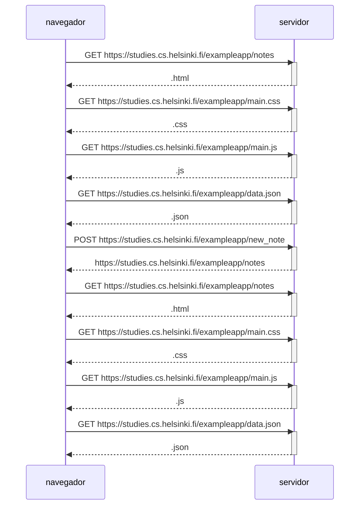

## sequenceDiagram

 

```mermaid
sequenceDiagram
    participant navegador
    participant servidor

    navegador->>servidor: GET https://studies.cs.helsinki.fi/exampleapp/notes
    activate servidor
    servidor-->>navegador: .html
    deactivate servidor

    navegador->>servidor: GET https://studies.cs.helsinki.fi/exampleapp/main.css
    activate servidor
    servidor-->>navegador: .css
    deactivate servidor

    navegador->>servidor: GET https://studies.cs.helsinki.fi/exampleapp/main.js
    activate servidor
    servidor-->>navegador: .js
    deactivate servidor

    navegador->>servidor: GET https://studies.cs.helsinki.fi/exampleapp/data.json
    activate servidor
    servidor-->>navegador: .json
    deactivate servidor

    navegador->>servidor: POST https://studies.cs.helsinki.fi/exampleapp/new_note
    activate servidor
    servidor-->>navegador: https://studies.cs.helsinki.fi/exampleapp/notes
    deactivate servidor

    navegador->>servidor: GET https://studies.cs.helsinki.fi/exampleapp/notes
    activate servidor
    servidor-->>navegador: .html
    deactivate servidor

    navegador->>servidor: GET https://studies.cs.helsinki.fi/exampleapp/main.css
    activate servidor
    servidor-->>navegador: .css
    deactivate servidor

    navegador->>servidor: GET https://studies.cs.helsinki.fi/exampleapp/main.js
    activate servidor
    servidor-->>navegador: .js
    deactivate servidor

    navegador->>servidor: GET https://studies.cs.helsinki.fi/exampleapp/data.json
    activate servidor
    servidor-->>navegador: .json
    deactivate servidor

```
